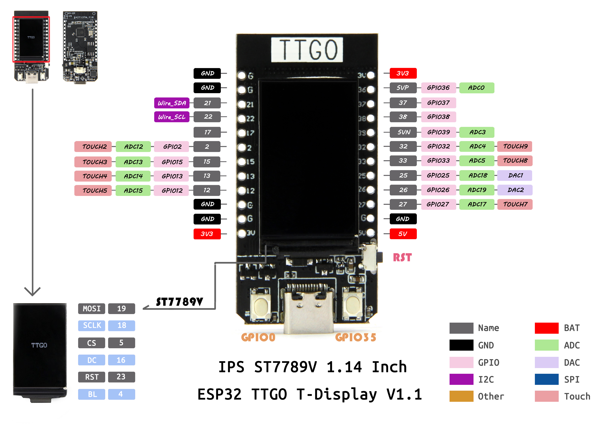

# "Hello world" program for the T-Display-ESP32 (legacy board, v1.1)

Project to bootstrap the use of [LilyGo T-Display-ESP32](https://github.com/Xinyuan-LilyGO/TTGO-T-Display) with its TFT display.

For reference, here's the pinout of the board:

# License

[Apache 2.0](LICENSE)
